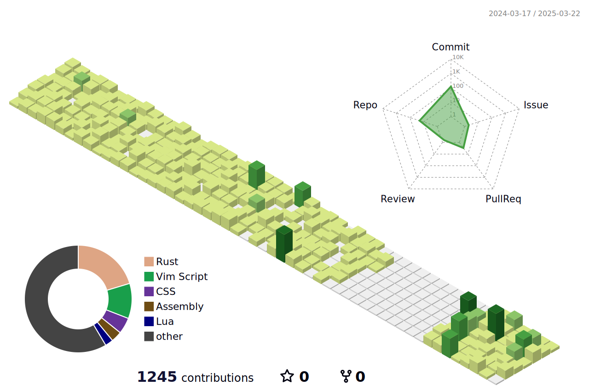

<!--
Hi My name is Kai

<!--


Hi My name is Kai
===========================================================================================================================

I mainly use rust for my projects. I also do a bit of lua, and python.

*   🚀  I'm currently working on [Personal Project](http://github.com/V1337Q/karat)
*   ☛  I've created a repository for you to start learning rust.
  By providing an example for each concept. (It's currently only available in Bahasa Indonesia, but I'll make sure to provide you with the en version once i covered all of the concept/subjects.)


  ### Skills 
<p align="left">
<a href="https://www.rust-lang.org/" target="_blank" rel="noreferrer"></a><a href="https://www.gnu.org/software/bash/" target="_blank" rel="noreferrer"></a><a href="https://neovim.io/" target="_blank" rel="noreferrer"></a><a href="https://www.linux.org" target="_blank" rel="noreferrer"></a>


<!---->

<!--

-->

<!--


<p align="right">
  
</p>


### Language stats

- Rust         ████████████████████████████████████████ 45.0%
- Vim Script   ████████████████████████ 30.0%
- CSS          ████████████ 15.0%
- Assembly     ███████ 7.0%
- Lua          ███ 3.0%
- Other        █ 0.0%


| Language    | Bar                                      | Percentage |
|-------------|------------------------------------------|------------|
| Rust        | ████████████████████████████████████████ | 45.0%      |
| Vim Script  | ████████████████████████                | 30.0%      |
| CSS         | ████████████                             | 15.0%      |
| Assembly    | ███████                                  | 7.0%       |
| Lua         | ███                                      | 3.0%       |
| Other       | █                                        | 0.0%       |

-->
```
Rust              ⣿⣿⣿⣿⣿⣿⣿⣿⣿⣀⣀⣀⣀⣀⣀⣀⣀⣀⣀⣀        45.0%
Vim Script        ⣿⣿⣿⣿⣿⣿⣀⣀⣀⣀⣀⣀⣀⣀⣀⣀⣀⣀⣀⣀        30.0%
CSS               ⣿⣿⣿⣀⣀⣀⣀⣀⣀⣀⣀⣀⣀⣀⣀⣀⣀⣀⣀⣀        15.0%
Assembly          ⣿⣄⣀⣀⣀⣀⣀⣀⣀⣀⣀⣀⣀⣀⣀⣀⣀⣀⣀⣀        7.0%
Lua               ⣄⣀⣀⣀⣀⣀⣀⣀⣀⣀⣀⣀⣀⣀⣀⣀⣀⣀⣀⣀        3.0%
Other             ⣀⣀⣀⣀⣀⣀⣀⣀⣀⣀⣀⣀⣀⣀⣀⣀⣀⣀⣀⣀        0.0%
``` 

